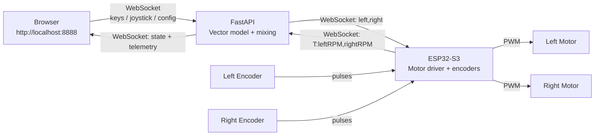
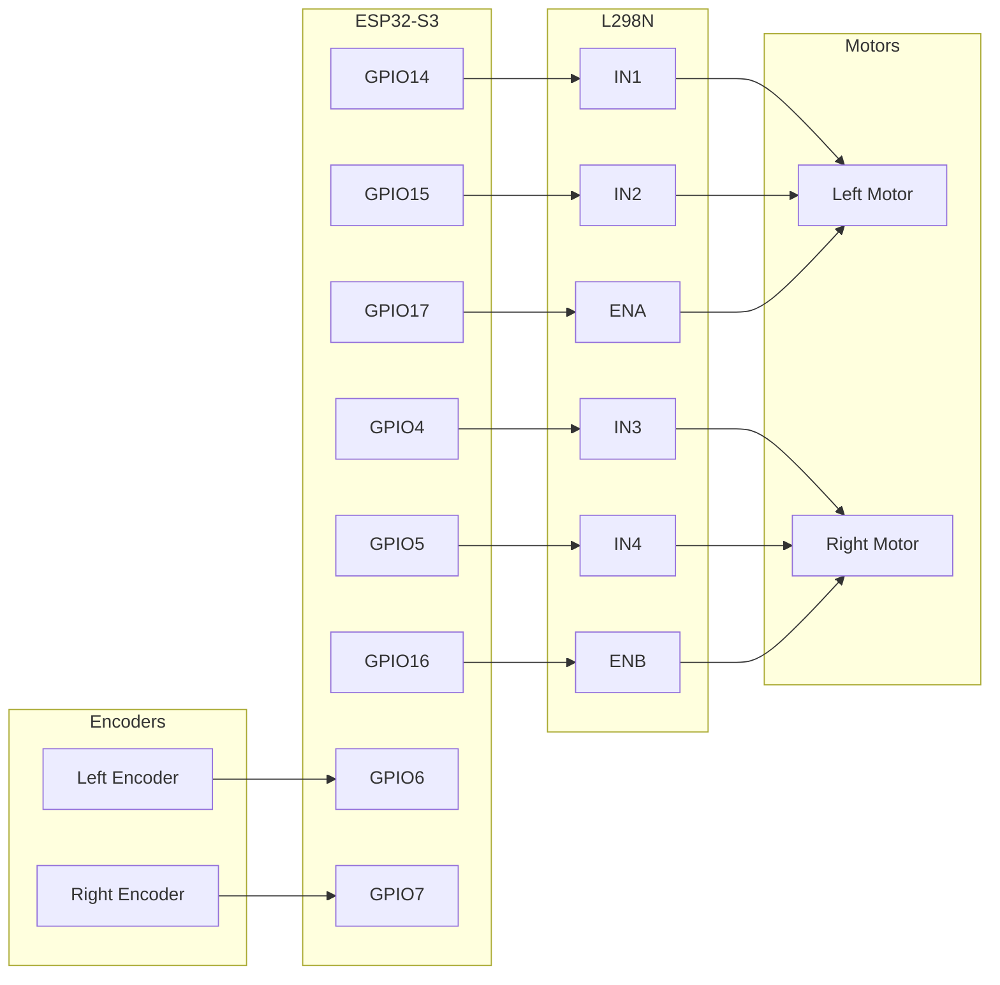

# Car Project — ESP32-S3-DEVKITC-1

Wi-Fi controlled differential-drive car using an ESP32-S3 and L298N motor driver. A FastAPI web UI provides smooth vector-based control with a virtual joystick, WASD keys, configurable acceleration, and real-time encoder telemetry. Deadman's handle ensures the car stops if the connection is lost.

---

## Quick Start

### 1. Flash the ESP32

1. Open this project in VS Code (PlatformIO will auto-detect it)
2. Edit [`include/config.h`](include/config.h) — set `WIFI_SSID` and `WIFI_PASSWORD`
3. Connect the board via USB
4. Build & upload (checkmark + arrow in the PlatformIO toolbar)
5. Open Serial Monitor — note the IP address printed (e.g. `192.168.5.82`)

### 2. Run the Web UI (recommended)

```powershell
.\start.ps1
```

This creates a `.venv`, installs dependencies, and launches the web controller at **http://localhost:8888**.

Set the ESP32 IP in the header bar and click **Connect**.

### 3. Alternative: lightweight CLI controller

```bash
pip install websocket-client pynput
```

Edit [`controller/drive.py`](controller/drive.py) — set `ESP32_IP`, then:

```bash
python controller/drive.py
```

### 4. Drive

| Key | Action |
|-----|--------|
| W | Forward |
| S | Backward |
| A | Pivot left |
| D | Pivot right |
| W+A | Forward-left arc |
| W+D | Forward-right arc |
| Release all | Stop (deadman's handle) |
| ESC | Quit (CLI only) |

You can also drag the **virtual joystick** in the web UI for 360° analog control (mouse + touch).

---

## Architecture



### Protocol

**Controller → ESP32** (every 50ms):

```text
left_speed,right_speed
```

Values range from `-255` (full backward) to `255` (full forward). Example: `"200,-200"` = pivot right.

**ESP32 → Controller** (every 100ms):

```text
T:left_rpm,right_rpm
```

Telemetry message with measured wheel RPM from the encoders.

---

## Motor Control Model

The web controller uses a 2D vector model instead of binary on/off:

1. **Input** — WASD keys produce a unit vector `(x, y)`. The virtual joystick produces an analog vector clamped to the unit circle. Joystick takes priority when non-zero.
2. **Acceleration ramp** — The current vector linearly interpolates toward the target vector at a configurable rate (`accel_time`: 0.1–2.0s).
3. **Differential mixing** — The `(x, y)` vector is converted to left/right motor speeds:
   - `left  = y + x × turn_sharpness`
   - `right = y − x × turn_sharpness`
4. **Output** — Values are clamped to `[-1, 1]`, then scaled by `max_speed` (0–255) and sent to the ESP32.

### Tunable Parameters (live from web UI)

| Parameter | Range | Default | Effect |
|-----------|-------|---------|--------|
| Acceleration | 0.1–2.0s | 0.5s | Time to reach full speed from standstill |
| Turn Sharpness | 0.0–1.0 | 0.5 | 0 = gentle arc, 1 = full pivot turn |
| Max Speed | 0–255 | 255 | PWM cap sent to motors |

### Deadman's Handle

The car is **safe by default**. The ESP32 expects a command every 250ms. If the timeout expires, motors go to zero. The browser also sends a stop command on window blur / disconnect.

---

## Encoder Telemetry

Each wheel has a 20-slot encoder disc read via hardware interrupts (`IRAM_ATTR` ISRs with `RISING` edge on `INPUT_PULLUP`). The ESP32 counts pulses, calculates RPM every 100ms, and broadcasts the result back to the controller.

RPM formula: `(pulses / slots_per_rev) / elapsed_seconds × 60`

The web UI displays live RPM values next to each wheel's PWM bar.

---

## Hardware

### Components

| Component | Details |
|-----------|---------|
| Board | ESP32-S3-DEVKITC-1 (dual-core Xtensa LX7, 240 MHz, Wi-Fi, BLE) |
| Motor driver | L298N (TB6612 available as upgrade) |
| Motors | 2× brushed DC |
| Power | 6V battery pack |
| Encoders | 2× single-channel wheel encoders, 20 slots per revolution |
| Battery sensor | Voltage divider (2× 10kΩ) on ADC pin — optional, UI auto-hides if not wired |

### Wiring



| L298N Pin | GPIO | Function |
|-----------|------|----------|
| ENA | 17 | Left motor speed (PWM) |
| IN1 | 14 | Left motor direction A |
| IN2 | 15 | Left motor direction B |
| ENB | 16 | Right motor speed (PWM) |
| IN3 | 4 | Right motor direction A |
| IN4 | 5 | Right motor direction B |

| Sensor | GPIO | Function |
|--------|------|----------|
| Left Encoder | 6 | Wheel pulse counting (interrupt-driven) |
| Right Encoder | 7 | Wheel pulse counting (interrupt-driven) |
| Battery divider | 8 | Voltage sensing via ADC (optional) |

---

## Project Structure

```text
_car/
├── start.ps1                 # One-click launcher (venv + deps + FastAPI)
├── requirements.txt          # Python dependencies
├── platformio.ini            # Board config, libraries, build flags
├── include/
│   ├── config.h              # Pin mappings, Wi-Fi creds, tunable constants
│   ├── motor_controller.h    # Motor control class header
│   ├── comms_manager.h       # Wi-Fi + WebSocket + telemetry class header
│   ├── encoder_monitor.h     # Interrupt-based encoder RPM monitor header
│   └── battery_monitor.h     # ADC battery voltage monitor header
├── src/
│   ├── main.cpp              # ESP32 firmware entry point
│   ├── motor_controller.cpp  # Motor control implementation
│   ├── comms_manager.cpp     # Wi-Fi + WebSocket + telemetry implementation
│   ├── encoder_monitor.cpp   # Encoder pulse counting + RPM calculation
│   └── battery_monitor.cpp   # ADC voltage reading + percentage calculation
├── controller/
│   ├── app.py                # FastAPI web controller (vector model + ESP32 proxy)
│   ├── drive.py              # Lightweight CLI controller (direct WASD → ESP32)
│   └── static/
│       └── index.html        # Web UI (joystick, car viz, telemetry, config, logs)
├── lib/                      # Project-specific libraries (empty for now)
└── README.md
```

### ESP32 Config ([`include/config.h`](include/config.h))

| Setting | Default | Purpose |
|---------|---------|---------|
| `WIFI_SSID` / `WIFI_PASSWORD` | (placeholder) | Wi-Fi credentials |
| `WEBSOCKET_PORT` | 81 | WebSocket server port on ESP32 |
| `DEADMAN_TIMEOUT_MS` | 250 | Stop motors after this many ms without a command |
| `TELEMETRY_INTERVAL_MS` | 100 | Encoder RPM broadcast interval |
| `ENCODER_SLOTS` | 20 | Slots per encoder disc revolution |
| `PWM_FREQUENCY` | 1000 | Motor PWM frequency (Hz) |
| `PWM_RESOLUTION` | 8 | Motor PWM resolution (bits, 0–255) |
| `MOTOR_LEFT_*` / `MOTOR_RIGHT_*` | see file | GPIO pin assignments |
| `ENCODER_LEFT` / `ENCODER_RIGHT` | 6, 7 | Encoder GPIO pins |
| `BATTERY_ADC_PIN` | 8 | GPIO for voltage divider output |
| `BATTERY_DIVIDER_RATIO` | 2.0 | Voltage multiplier (matches resistor ratio) |
| `BATTERY_FULL_VOLTAGE` | 6.0 | 100% charge voltage |
| `BATTERY_LOW_VOLTAGE` | 4.5 | Low battery warning threshold |

### Web UI Features

- **Virtual joystick** — drag for 360° analog control (mouse + touch), unit circle clamped, snaps to center on release
- **WASD controls** — keyboard or on-screen buttons
- **Car top-down view** — rear wheels light up green (forward) / red (backward)
- **Direction arrow** — rotates to show movement direction
- **Motor value bars** — real-time left/right PWM display
- **RPM display** — live encoder telemetry for each wheel
- **Config sliders** — acceleration time, turn sharpness, max speed (applied live)
- **ESP32 connection config** — change IP:port from the header bar, reconnects automatically
- **Status indicators** — green dots for Server (browser↔FastAPI) and ESP32 (FastAPI↔board)
- **Console log** — connection events, config changes, warnings (color-coded)
- **Auto-reconnect** — browser reconnects on WebSocket disconnect
- **Safety** — window blur sends stop command

---

## Development

### Tooling

| Tool | Purpose |
|------|---------|
| [VS Code](https://code.visualstudio.com/) | Editor / IDE |
| [PlatformIO IDE](https://marketplace.visualstudio.com/items?itemName=platformio.platformio-ide) | Build, upload, serial monitor, library management |
| Python 3 + FastAPI + uvicorn + websockets | Web UI controller |

### ESP32 Workflow

1. **Build** — checkmark (✓) in the PlatformIO toolbar, or `Ctrl+Alt+B`
2. **Upload** — arrow (→) in the toolbar, or `Ctrl+Alt+U`
3. **Serial Monitor** — plug icon in the toolbar, or `Ctrl+Alt+S` (115200 baud)

### Libraries

| Library | Platform | Purpose |
|---------|----------|---------|
| [WebSockets](https://github.com/Links2004/arduinoWebSockets) ^2.6.1 | ESP32 | WebSocket server |
| [FastAPI](https://fastapi.tiangolo.com/) | Python | Web UI backend |
| [websockets](https://websockets.readthedocs.io/) | Python | ESP32 WebSocket client |
| [pynput](https://pynput.readthedocs.io/) | Python | Keyboard input (CLI controller) |

---

## Roadmap

- [x] **Phase 1** — Motor wiring test (verify L/R, forward/backward)
- [x] **Phase 2** — WebSocket server on ESP32 (Wi-Fi, command parsing, deadman's handle)
- [x] **Phase 3** — Python PC controller (WASD keyboard input over WebSocket)
- [x] **Phase 3.5** — Web UI (FastAPI + browser dashboard with car viz, logs, config)
- [x] **Code refactor** — Split into MotorController, CommsManager, EncoderMonitor service classes
- [x] **Smooth control** — Vector-based model, acceleration ramp, differential mixing, virtual joystick
- [x] **Encoder telemetry** — Interrupt-based RPM monitoring, ESP32→controller→browser display
- [x] **Battery monitoring** — ADC voltage sensing via voltage divider, low-battery warning in UI
- [ ] **Closed-loop control** — Use encoder feedback for PID speed matching (left = right)

---

## Useful Links

- [ESP32-S3-DEVKITC-1 official docs](https://docs.espressif.com/projects/esp-idf/en/stable/esp32s3/hw-reference/esp32s3/user-guide-devkitc-1.html)
- [ESP32-S3 datasheet](https://www.espressif.com/sites/default/files/documentation/esp32-s3_datasheet_en.pdf)
- [Arduino-ESP32 documentation](https://docs.espressif.com/projects/arduino-esp32/en/latest/)
- [PlatformIO ESP32-S3 boards](https://docs.platformio.org/en/latest/boards/espressif32/esp32-s3-devkitc-1.html)
