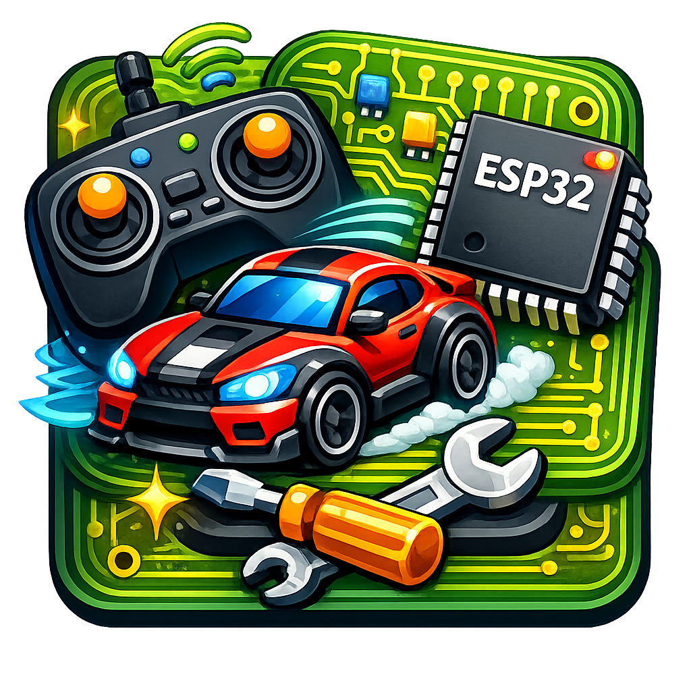
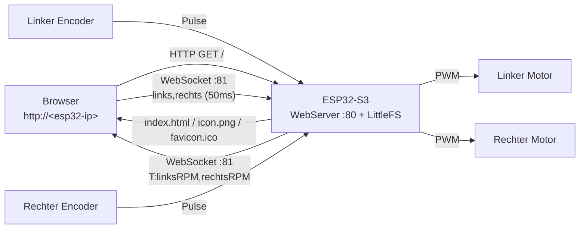
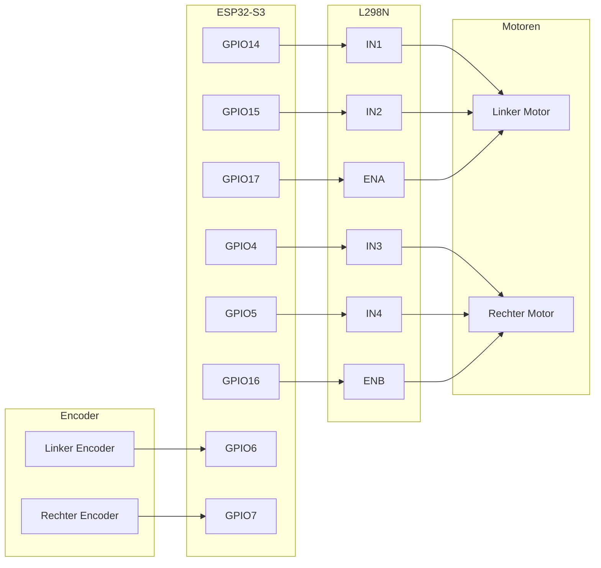

# Auto-Projekt — ESP32-S3-DEVKITC-1

WLAN-gesteuertes Differentialantrieb-Auto mit einem ESP32-S3 und L298N Motortreiber. Der ESP32 stellt die Weboberfläche direkt aus seinem Flash-Speicher (LittleFS) bereit — kein PC oder Server nötig. Einfach die IP-Adresse des ESP32 im Browser öffnen und losfahren. Die Steuerlogik läuft vollständig im Browser und kommuniziert per WebSocket direkt mit der Platine.



---

## Schnellstart

### 1. Konfigurieren

[`include/config.h`](include/config.h) öffnen und `WIFI_SSID` sowie `WIFI_PASSWORD` eintragen.

### 2. Firmware flashen

```bash
pio run -t upload
```

### 3. Weboberfläche flashen

```bash
pio run -t uploadfs
```

Überträgt `data/index.html`, `data/favicon.ico` und `data/icon.png` in den LittleFS-Speicher des ESP32.

### 4. Seriellen Monitor öffnen

Die angezeigte IP-Adresse (z.B. `192.168.5.82`) notieren, dann `http://<ip>` im Browser öffnen.

### 5. Fahren

| Taste | Aktion |
| ----- | ------ |
| W | Vorwärts |
| S | Rückwärts |
| A | Links drehen |
| D | Rechts drehen |
| W+A | Vorwärts-links Kurve |
| W+D | Vorwärts-rechts Kurve |
| Alle loslassen | Stopp (Totmann-Schalter) |

Den **virtuellen Joystick** ziehen für 360°-Analogsteuerung (Maus + Touch).

---

## Architektur

Die Weboberfläche wird direkt vom ESP32 ausgeliefert. Der Browser verbindet sich per WebSocket zurück zum gleichen Host — kein Python, kein FastAPI, kein PC dazwischen.



### Protokoll

**Browser → ESP32** (alle 50ms):

```text
links_speed,rechts_speed
```

Wertebereich: `-255` (volle Rückwärtsfahrt) bis `255` (volle Vorwärtsfahrt). Beispiel: `"200,-200"` = Pirouette rechts.

**ESP32 → Browser** (alle 100ms):

```text
T:links_rpm,rechts_rpm
```

> Die Weboberfläche unterstützt einen optionalen dritten Wert `T:links,rechts,akkuV` — die Akkuanzeige erscheint automatisch sobald dieser gesendet wird. Die Akkuüberwachungs-Software ist aktuell nicht implementiert (Hardware vorhanden, siehe config.h).

---

## Steuermodell

Die Steuerlogik läuft vollständig im Browser (JavaScript) im 50ms-Takt.

1. **Eingabe** — WASD-Tasten erzeugen einen Einheitsvektor `(x, y)`. Der virtuelle Joystick erzeugt einen analogen Vektor, begrenzt auf den Einheitskreis. Joystick hat Vorrang wenn er bewegt wird.
2. **Beschleunigungsrampe** — Der aktuelle Vektor interpoliert linear zum Zielvektor mit konfigurierbarer Rate (`accel_time`: 0,1–2,0s).
3. **Differentialmischung** — `(x, y)` → links/rechts Motorgeschwindigkeiten:
   - `links  = y + x × turn_sharpness`
   - `rechts = y − x × turn_sharpness`
4. **Ausgabe** — Auf `[-1, 1]` begrenzt, mit `max_speed` (0–255) skaliert, an ESP32 gesendet.

### Einstellbare Parameter (Live-Schieberegler in der UI)

| Parameter | Bereich | Standard | Wirkung |
| --------- | ------- | -------- | ------- |
| Beschleunigung | 0,1–2,0s | 0,5s | Zeit bis Vollgas aus dem Stand |
| Kurvenradius | 0,0–1,0 | 0,5 | 0 = weicher Bogen, 1 = Pirouette auf der Stelle |
| Max. Geschwindigkeit | 0–255 | 255 | PWM-Obergrenze an die Motoren |

### Totmann-Schalter

Der ESP32 erwartet alle 250ms einen Fahrbefehl. Läuft das Timeout ab, stoppen die Motoren. Der Browser sendet beim Fokusverlust des Fensters und bei WebSocket-Verbindungsabbruch ebenfalls einen Stopp-Befehl.

---

## Encoder-Telemetrie

Jedes Rad hat eine Encoderscheibe mit 20 Schlitzen, ausgelesen per Hardware-Interrupt (`IRAM_ATTR` ISR, `RISING`-Flanke, `INPUT_PULLUP`). Die Drehzahl wird alle 100ms berechnet und an den Browser gesendet.

RPM-Formel: `(Pulse / Schlitze_pro_Umdrehung) / vergangene_Sekunden × 60`

---

## Hardware

### Komponenten

| Bauteil | Details |
| ------- | ------- |
| Platine | ESP32-S3-DEVKITC-1 (Dual-Core Xtensa LX7, 240 MHz, WLAN, BLE) |
| Motortreiber | L298N |
| Motoren | 2× Bürstenmotor DC |
| Stromversorgung | 6V Akkupack |
| Encoder | 2× Einkanal-Radencoder, 20 Schlitze/Umdrehung |
| Akkusensor | Spannungsteiler (2× 10kΩ) an ADC-Pin — optional |

### Verkabelung



| L298N Pin | GPIO | Funktion |
| --------- | ---- | -------- |
| ENA | 17 | Linker Motor Geschwindigkeit (PWM) |
| IN1 | 14 | Linker Motor Richtung A |
| IN2 | 15 | Linker Motor Richtung B |
| ENB | 16 | Rechter Motor Geschwindigkeit (PWM) |
| IN3 | 4 | Rechter Motor Richtung A |
| IN4 | 5 | Rechter Motor Richtung B |

| Sensor | GPIO | Funktion |
| ------ | ---- | -------- |
| Linker Encoder | 6 | Radzählung per Interrupt |
| Rechter Encoder | 7 | Radzählung per Interrupt |
| Akkuspannungsteiler | 8 | Spannungsmessung per ADC (optional) |

---

## Projektstruktur

```text
_car/
├── platformio.ini            # Board-Konfiguration, Bibliotheken, Build-Flags
├── include/
│   ├── config.h              # Pin-Belegung, WLAN-Zugangsdaten, Konstanten
│   ├── motor_controller.h
│   ├── comms_manager.h
│   └── encoder_monitor.h
├── src/
│   ├── main.cpp              # Einstiegspunkt: HTTP-Server + LittleFS-Routen
│   ├── motor_controller.cpp  # L298N PWM-Steuerung
│   ├── comms_manager.cpp     # WebSocket-Server + Telemetrie-Broadcast
│   └── encoder_monitor.cpp   # Interrupt-basierte Encoder-RPM-Berechnung
├── data/                     # Wird per `pio run -t uploadfs` auf LittleFS übertragen
│   ├── index.html            # Komplette Weboberfläche (JS-Steuerung, Joystick, Telemetrie)
│   ├── favicon.ico           # Browser-Tab-Symbol
│   └── icon.png              # App-Icon (Header + Apple Touch Icon)
└── README.md
```

### ESP32-Konfiguration ([`include/config.h`](include/config.h))

| Einstellung | Standard | Bedeutung |
| ----------- | -------- | --------- |
| `WIFI_SSID` / `WIFI_PASSWORD` | (Platzhalter) | WLAN-Zugangsdaten |
| `STATIC_IP` / `STATIC_GATEWAY` / `STATIC_SUBNET` / `STATIC_DNS` | gesetzt | Statische IP — alle vier auskommentieren für DHCP |
| `WEBSOCKET_PORT` | 81 | WebSocket-Server-Port |
| `DEADMAN_TIMEOUT_MS` | 250 | Motoren stoppen nach dieser Zeit ohne Befehl (ms) |
| `TELEMETRY_INTERVAL_MS` | 100 | Sendeintervall für Encoder-RPM (ms) |
| `ENCODER_SLOTS` | 20 | Schlitze pro Encoderscheibenumdrehung |
| `PWM_FREQUENCY` | 1000 | Motor-PWM-Frequenz (Hz) |
| `PWM_RESOLUTION` | 8 | PWM-Auflösung (Bit, 0–255) |
| `MOTOR_LEFT_*` / `MOTOR_RIGHT_*` | siehe Datei | GPIO-Pin-Belegung der Motoren |
| `ENCODER_LEFT` / `ENCODER_RIGHT` | 6, 7 | GPIO-Pins der Encoder |
| `BATTERY_ADC_PIN` | 8 | GPIO für den Spannungsteilerausgang *(reserviert, SW noch nicht implementiert)* |
| `BATTERY_DIVIDER_RATIO` | 2,0 | Spannungsmultiplikator *(reserviert)* |
| `BATTERY_FULL_VOLTAGE` | 6,0 | Spannung bei vollem Akku *(reserviert)* |
| `BATTERY_LOW_VOLTAGE` | 4,5 | Schwellwert für Niedrigakku-Warnung *(reserviert)* |

### Funktionen der Weboberfläche

- **Virtueller Joystick** — ziehen für 360°-Analogsteuerung (Maus + Touch), auf Einheitskreis begrenzt
- **WASD-Steuerung** — Tastatur oder Bildschirmtasten
- **Auto-Draufsicht** — Hinterräder leuchten grün (vorwärts) / rot (rückwärts)
- **Richtungspfeil** — dreht sich entsprechend der Fahrtrichtung
- **Motor-PWM-Balken** — Echtzeit-Anzeige der Motorwerte links/rechts
- **RPM-Anzeige** — Live-Telemetrie beider Räder
- **Akkuanzeige** — Spannungsbalken + Niedrigakku-Warnung (blendet sich aus wenn nicht angeschlossen)
- **Einstellregler** — Beschleunigung, Kurvenradius, Maximalgeschwindigkeit (sofort wirksam)
- **Konsolenlog** — Verbindungsereignisse, Konfigurationsänderungen, Warnungen (farbkodiert)
- **Auto-Reconnect** — Browser verbindet sich bei WebSocket-Unterbrechung automatisch neu
- **Sicherheit** — Fokusverlust des Fensters sendet Stopp-Befehl

---

## Entwicklung

### Werkzeuge

- [VS Code](https://code.visualstudio.com/) + [PlatformIO](https://marketplace.visualstudio.com/items?itemName=platformio.platformio-ide) — Bauen, Flashen, Serieller Monitor

### Arbeitsablauf

| Aktion                          | Befehl                              |
|---------------------------------|-------------------------------------|
| Firmware bauen                  | `pio run`                           |
| Firmware flashen                | `pio run -t upload`                 |
| Weboberfläche flashen (LittleFS)| `pio run -t uploadfs`               |
| Serieller Monitor               | `pio device monitor` (115200 Baud)  |

### Bibliotheken (ESP32)

| Bibliothek                                                           | Zweck                                   |
|----------------------------------------------------------------------|-----------------------------------------|
| [WebSockets](https://github.com/Links2004/arduinoWebSockets) ^2.6.1  | WebSocket-Server auf Port 81            |
| Arduino `WebServer` (integriert)                                     | HTTP-Server auf Port 80                 |
| `LittleFS` (integriert)                                              | Weboberflächen-Dateien aus dem Flash    |

---

## Roadmap

- [x] **Phase 1** — Motor-Verkabelungstest
- [x] **Phase 2** — WebSocket-Server auf ESP32
- [x] **Phase 3** — Python-PC-Controller (WASD über WebSocket)
- [x] **Phase 3.5** — Weboberfläche über FastAPI + Browser-Dashboard
- [x] **Phase 4** — Weboberfläche auf ESP32 (LittleFS) — kein PC mehr nötig
- [x] **Code-Refactoring** — MotorController, CommsManager, EncoderMonitor als Serviceklassen
- [x] **Sanfte Steuerung** — Vektormodell, Beschleunigungsrampe, Differentialmischung, virtueller Joystick
- [x] **Encoder-Telemetrie** — Interrupt-basierte RPM, Übertragung an Browser
- [ ] **Akkuüberwachung** — Hardware (Spannungsteiler GPIO8) vorhanden, Software noch nicht implementiert
- [x] **Icons** — favicon.ico + icon.png aus LittleFS
- [ ] **Closed-Loop-Regelung** — PID-Drehzahlabgleich (links = rechts) per Encoder-Feedback

---

## Nützliche Links

- [ESP32-S3-DEVKITC-1 Dokumentation](https://docs.espressif.com/projects/esp-idf/en/stable/esp32s3/hw-reference/esp32s3/user-guide-devkitc-1.html)
- [Arduino-ESP32 Dokumentation](https://docs.espressif.com/projects/arduino-esp32/en/latest/)
- [PlatformIO ESP32-S3 Boards](https://docs.platformio.org/en/latest/boards/espressif32/esp32-s3-devkitc-1.html)
