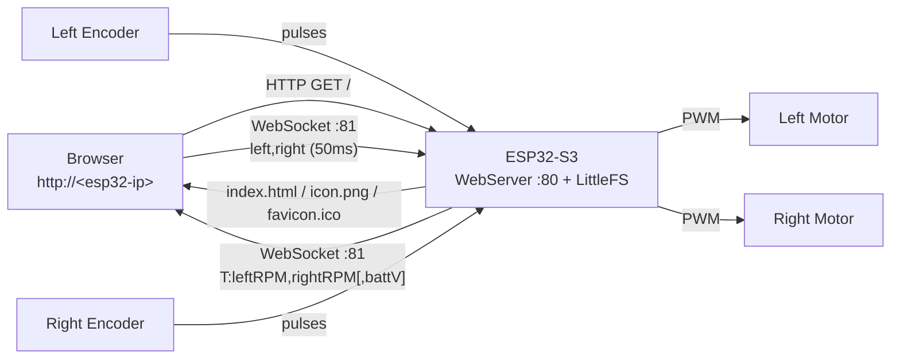
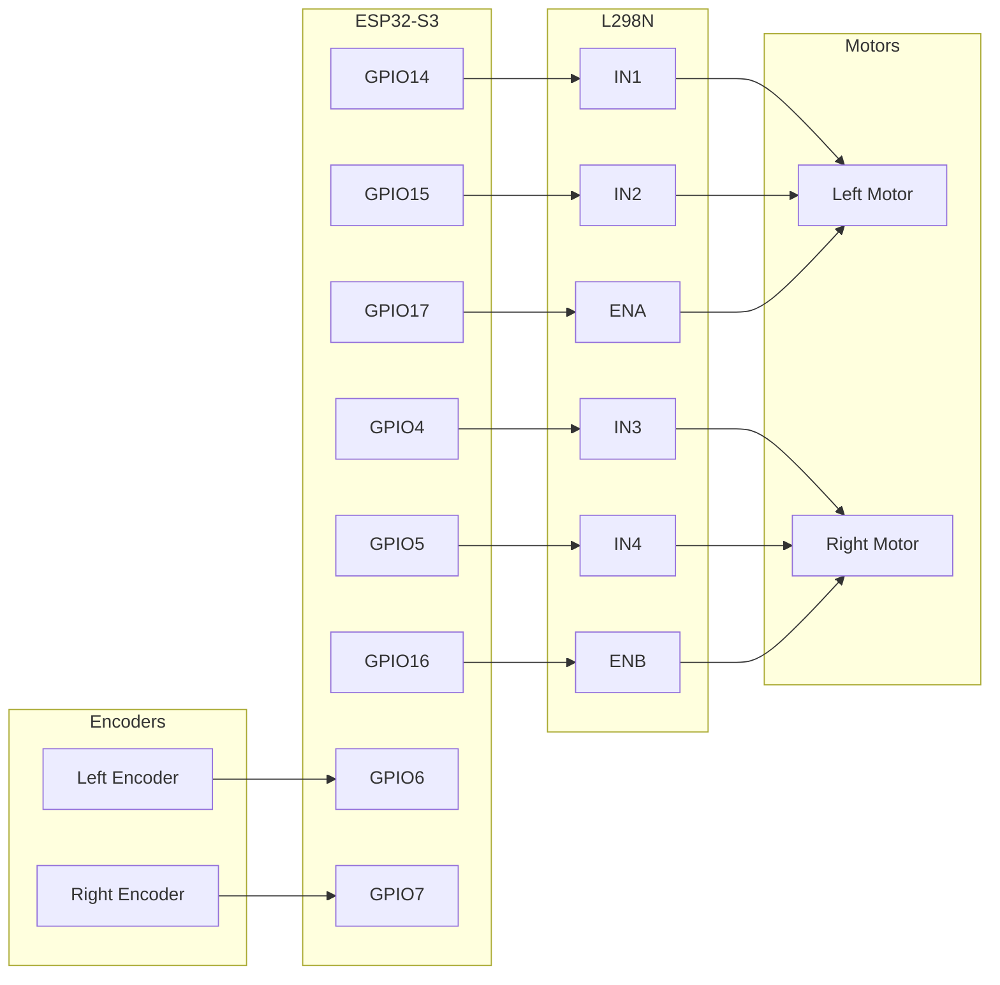

# Car Project — ESP32-S3-DEVKITC-1

Wi-Fi controlled differential-drive car using an ESP32-S3 and L298N motor driver. The ESP32 hosts the web UI directly from its flash (LittleFS), so no PC/server is needed — connect to the ESP32's IP and drive. The browser runs the full control loop and connects via WebSocket directly to the board.

---

## Quick Start

### 1. Configure

Edit [`include/config.h`](include/config.h) — set `WIFI_SSID` and `WIFI_PASSWORD`.

### 2. Flash firmware

```bash
pio run -t upload
```

### 3. Flash web UI

```bash
pio run -t uploadfs
```

This uploads `data/index.html`, `data/favicon.ico`, and `data/icon.png` to LittleFS on the ESP32.

### 4. Open Serial Monitor

Note the IP address printed (e.g. `192.168.5.82`), then open `http://<ip>` in a browser.

### 5. Drive

| Key | Action |
|-----|--------|
| W | Forward |
| S | Backward |
| A | Pivot left |
| D | Pivot right |
| W+A | Forward-left arc |
| W+D | Forward-right arc |
| Release all | Stop (deadman's handle) |

Drag the **virtual joystick** for 360° analog control (mouse + touch).

---

## Architecture

The web UI is served directly from the ESP32. The browser connects back to the same host via WebSocket — no Python, no FastAPI, no PC middleman.



### Protocol

**Browser → ESP32** (every 50ms):

```text
left_speed,right_speed
```

Values: `-255` (full backward) to `255` (full forward). Example: `"200,-200"` = pivot right.

**ESP32 → Browser** (every 100ms):

```text
T:left_rpm,right_rpm[,battery_voltage]
```

Battery voltage field is optional — UI hides the battery widget if absent or `< 0.5`.

---

## Motor Control Model

The control loop runs entirely in the browser (JavaScript) at 50ms intervals.

1. **Input** — WASD keys produce a unit vector `(x, y)`. The virtual joystick produces an analog vector clamped to the unit circle. Joystick takes priority when non-zero.
2. **Acceleration ramp** — Current vector linearly interpolates toward target at a configurable rate (`accel_time`: 0.1–2.0s).
3. **Differential mixing** — `(x, y)` → left/right motor speeds:
   - `left  = y + x × turn_sharpness`
   - `right = y − x × turn_sharpness`
4. **Output** — Clamped to `[-1, 1]`, scaled by `max_speed` (0–255), sent to ESP32.

### Tunable Parameters (live sliders in UI)

| Parameter | Range | Default | Effect |
|-----------|-------|---------|--------|
| Acceleration | 0.1–2.0s | 0.5s | Time to reach full speed from standstill |
| Turn Sharpness | 0.0–1.0 | 0.5 | 0 = gentle arc, 1 = full pivot turn |
| Max Speed | 0–255 | 255 | PWM cap sent to motors |

### Deadman's Handle

The ESP32 expects a command every 250ms. If the timeout expires, motors stop. The browser also sends a stop on window blur / WebSocket disconnect.

---

## Encoder Telemetry

Each wheel has a 20-slot encoder disc read via hardware interrupts (`IRAM_ATTR` ISRs, `RISING` edge, `INPUT_PULLUP`). RPM is calculated every 100ms and broadcast to the browser.

RPM formula: `(pulses / slots_per_rev) / elapsed_seconds × 60`

---

## Hardware

### Components

| Component | Details |
|-----------|---------|
| Board | ESP32-S3-DEVKITC-1 (dual-core Xtensa LX7, 240 MHz, Wi-Fi, BLE) |
| Motor driver | L298N |
| Motors | 2× brushed DC |
| Power | 6V battery pack |
| Encoders | 2× single-channel wheel encoders, 20 slots/rev |
| Battery sensor | Voltage divider (2× 10kΩ) on ADC pin — optional |

### Wiring



| L298N Pin | GPIO | Function |
|-----------|------|----------|
| ENA | 17 | Left motor speed (PWM) |
| IN1 | 14 | Left motor direction A |
| IN2 | 15 | Left motor direction B |
| ENB | 16 | Right motor speed (PWM) |
| IN3 | 4 | Right motor direction A |
| IN4 | 5 | Right motor direction B |

| Sensor | GPIO | Function |
|--------|------|----------|
| Left Encoder | 6 | Wheel pulse counting (interrupt-driven) |
| Right Encoder | 7 | Wheel pulse counting (interrupt-driven) |
| Battery divider | 8 | Voltage sensing via ADC (optional) |

---

## Project Structure

```text
_car/
├── platformio.ini            # Board config, libraries, build flags
├── include/
│   ├── config.h              # Pin mappings, Wi-Fi creds, tunable constants
│   ├── motor_controller.h
│   ├── comms_manager.h
│   ├── encoder_monitor.h
│   └── battery_monitor.h
├── src/
│   ├── main.cpp              # ESP32 entry point: HTTP server + LittleFS routes
│   ├── motor_controller.cpp  # L298N PWM control
│   ├── comms_manager.cpp     # WebSocket server + telemetry broadcast
│   ├── encoder_monitor.cpp   # Interrupt-based encoder RPM
│   └── battery_monitor.cpp   # ADC voltage reading
├── data/                     # Uploaded to LittleFS via `pio run -t uploadfs`
│   ├── index.html            # Full web UI (JS control loop, joystick, viz, telemetry)
│   ├── favicon.ico           # Browser tab icon
│   └── icon.png              # App icon (header + apple-touch-icon)
└── README.md
```

### ESP32 Config ([`include/config.h`](include/config.h))

| Setting | Default | Purpose |
|---------|---------|---------|
| `WIFI_SSID` / `WIFI_PASSWORD` | (placeholder) | Wi-Fi credentials |
| `WEBSOCKET_PORT` | 81 | WebSocket server port |
| `DEADMAN_TIMEOUT_MS` | 250 | Stop motors after this many ms without a command |
| `TELEMETRY_INTERVAL_MS` | 100 | Encoder RPM broadcast interval |
| `ENCODER_SLOTS` | 20 | Slots per encoder disc revolution |
| `PWM_FREQUENCY` | 1000 | Motor PWM frequency (Hz) |
| `PWM_RESOLUTION` | 8 | PWM resolution (bits, 0–255) |
| `MOTOR_LEFT_*` / `MOTOR_RIGHT_*` | see file | GPIO pin assignments |
| `ENCODER_LEFT` / `ENCODER_RIGHT` | 6, 7 | Encoder GPIO pins |
| `BATTERY_ADC_PIN` | 8 | GPIO for voltage divider output |
| `BATTERY_DIVIDER_RATIO` | 2.0 | Voltage multiplier (matches resistor ratio) |
| `BATTERY_FULL_VOLTAGE` | 6.0 | 100% charge voltage |
| `BATTERY_LOW_VOLTAGE` | 4.5 | Low battery warning threshold |

### Web UI Features

- **Virtual joystick** — drag for 360° analog control (mouse + touch), unit circle clamped
- **WASD controls** — keyboard or on-screen buttons
- **Car top-down view** — rear wheels light green (forward) / red (backward)
- **Direction arrow** — rotates to show movement direction
- **Motor PWM bars** — real-time left/right PWM values
- **RPM display** — live encoder telemetry per wheel
- **Battery indicator** — voltage bar + low battery warning (auto-hides if not wired)
- **Config sliders** — acceleration, turn sharpness, max speed (applied live)
- **Console log** — connection events, config changes, warnings (color-coded)
- **Auto-reconnect** — browser reconnects on WebSocket disconnect
- **Safety** — window blur sends stop command

---

## Development

### Tooling

- [VS Code](https://code.visualstudio.com/) + [PlatformIO](https://marketplace.visualstudio.com/items?itemName=platformio.platformio-ide) — Build, upload, serial monitor

### Workflow

| Action                    | Command                             |
|---------------------------|-------------------------------------|
| Build firmware            | `pio run`                           |
| Upload firmware           | `pio run -t upload`                 |
| Upload web UI (LittleFS)  | `pio run -t uploadfs`               |
| Serial monitor            | `pio device monitor` (115200 baud)  |

### Libraries (ESP32)

| Library                                                              | Purpose                          |
|----------------------------------------------------------------------|----------------------------------|
| [WebSockets](https://github.com/Links2004/arduinoWebSockets) ^2.6.1  | WebSocket server on port 81      |
| Arduino `WebServer` (built-in)                                       | HTTP server on port 80           |
| `LittleFS` (built-in)                                                | Serves web UI files from flash   |

---

## Roadmap

- [x] **Phase 1** — Motor wiring test
- [x] **Phase 2** — WebSocket server on ESP32
- [x] **Phase 3** — Python PC controller (WASD over WebSocket)
- [x] **Phase 3.5** — Web UI via FastAPI + browser dashboard
- [x] **Phase 4** — Migrate web UI to ESP32-hosted LittleFS (no PC needed)
- [x] **Code refactor** — MotorController, CommsManager, EncoderMonitor service classes
- [x] **Smooth control** — Vector model, acceleration ramp, differential mixing, virtual joystick
- [x] **Encoder telemetry** — Interrupt-based RPM, broadcast to browser
- [x] **Battery monitoring** — ADC voltage divider, low-battery warning in UI
- [x] **Icons** — favicon.ico + icon.png served from LittleFS
- [ ] **Closed-loop control** — PID speed matching (left = right) via encoder feedback

---

## Useful Links

- [ESP32-S3-DEVKITC-1 docs](https://docs.espressif.com/projects/esp-idf/en/stable/esp32s3/hw-reference/esp32s3/user-guide-devkitc-1.html)
- [Arduino-ESP32 docs](https://docs.espressif.com/projects/arduino-esp32/en/latest/)
- [PlatformIO ESP32-S3 boards](https://docs.platformio.org/en/latest/boards/espressif32/esp32-s3-devkitc-1.html)
